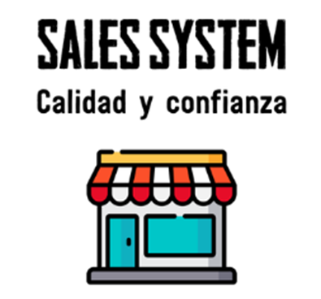
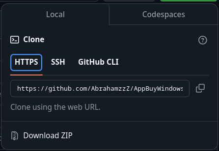

# Sistemas de Ventas de Productos



<br>

<!-- BADGES -->
<div>
  <a href="#">
    
  </a>
  <a href="#">
    
  </a>
</div>

<h1 align="center" style="font-weight:mediun; padding:30px;">🌲 AppBuyWindows | Sistemas de Ventas de Productos</h1>

Grupo de Construcion de Software Sof-Ve-6-2

## 📝 Tabla de Contenidos

## Instalacion

En esta sección se explica el proceso de instalación de todas las dependencias necesarias para ejecutar el proyecto.

### 📦 Requerimientos de Instalacion

- [Visual Studio 2022 - Descarga](https://visualstudio.microsoft.com/es/downloads/)
- [Sql Server - Descarga](https://www.microsoft.com/es-es/sql-server/sql-server-downloads)
- [Git - Descarga](https://git-scm.com/downloads)
- [.Net 8 SDK - Descarga](https://dotnet.microsoft.com/download/dotnet/8.0)

### 📝 Clonar Repositorio

```sh
git clone https://github.com/AbrahamzzZ/AppBuyWindows.git
cd AppBuyWindows
```

o tambien puedes decargar el zip de la ultima release/Commit del Repositorio



## 📦 Instalacion de base de datos

En esta sección se explica el proceso de instalación de la base de datos.

> [!WARNING]  
> ⚠ Recuerde tener instalado el [Sql Server](https://www.microsoft.com/es-es/sql-server/sql-server-downloads)

```sh
sqlcmd -S localhost -U sa -P TuPassword -d master -i "./BD_Query/BD.sql"
```

> [!WARNING]  
> ⚠ Recuerde cambiar la contraseña de la base de datos por tu contraseña

> [!WARNING]  
> ⚠ Recuerde cambiar el nombre del servidor por tu nombre

## 🚀 Ejecución del Proyecto
En esta sección se explica el proceso de ejecución del proyecto.

```sh
dotnet run
```

## 📝 Licencia

Este proyecto está licenciado bajo licencia **MIT**, si desea saber más, visite la sección [License](./LICENSE) para su información completa.